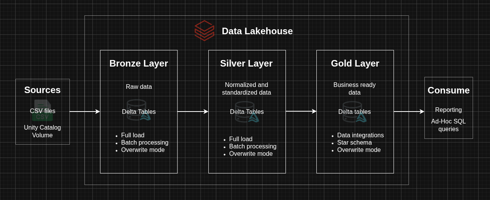
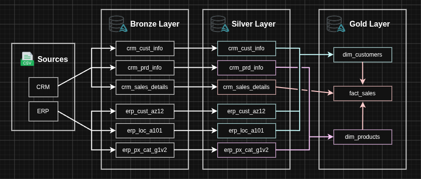
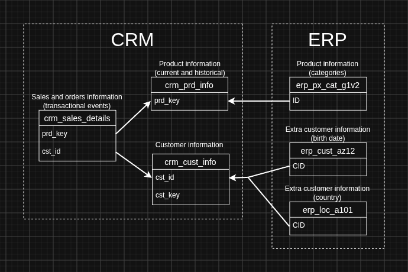
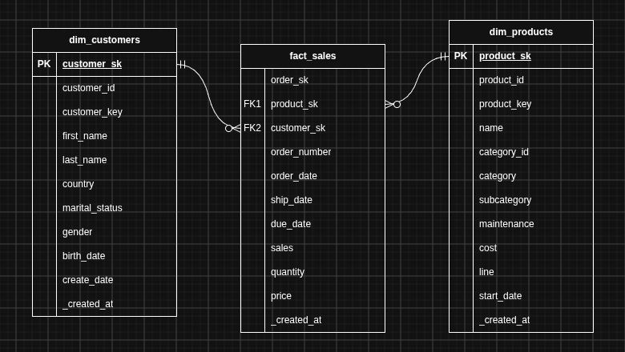

# Databricks Data Lakehouse Project

A modern implementation of a Data Lakehouse in Databricks.

> **Acknowledgment:** This project was inspired by this [YouTube bootcamp](https://www.youtube.com/watch?v=ldBLOasG23w) by [Data with Baraa](https://www.youtube.com/@DataWithBaraa). The datasets (CSV files) are part of this tutorial.

## Architecture

This project follows Medallion Architecture:

## Data flow

Diagram to visualize where the data came from, and how it *flows* through the different layers.

## Integration model

Diagram to document how different tables are related to each other.

## Data model

Diagram to document primary and foreign keys in the gold layer: dimension and fact tables.

## Details

### Data directory

This directory contains all the CSV files used by this project. I decided to include those files (~5.4MB) to improve the project's reproducibility. The `src/00_prepare_data.py` script automatically copies the CSV files into the Unity Catalog Volume created by the `ddl/init_lakehouse.sql` script in order to avoid manual upload.

> I know this is not a common practice, but I wanted to make this project as reproducible as possible.

### Date type columns

When an invalid string cannot be properly cast to Date type I use two conventions:
1. `2099-01-01` (sentinel value) to indicate current/active status (e.g. column `end_date` in the table `crm_prd_info`).
2. `NULL` in any other situation (e.g. column `order_date` in the table `crm_sales_details`).
